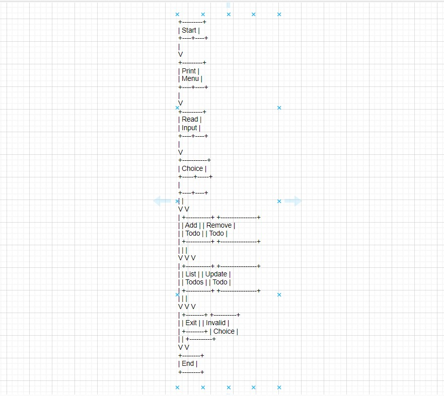
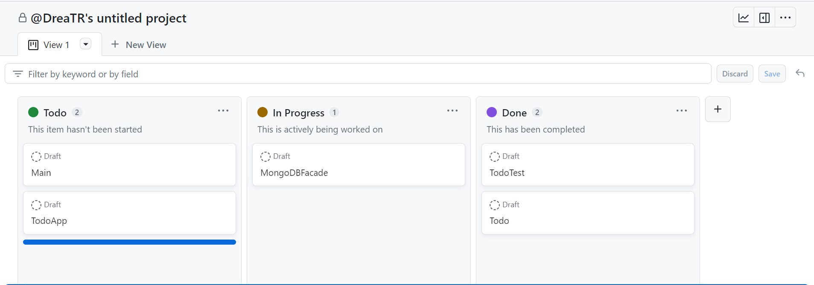

# Ditt namn

Andrea Torres

## Egna reflektioner

## Projektet

Enskild inlämningsuppgift Todo

### Beskrivning av projektet

Vi skulle skapa en TODO Applikation med ett menysystem som kan hantera TODO, samt skapa tester för 
applikationen. I programmet TODO ska man kunna skapa, läsa ut, redigera samt radera TODO enligt CRUD principen. 
TODO ska existera i en databas, antingen MongoDB eller SQLite. Jag valde att använda MongoDB.

### Vad du har gjort

Skapade fyra klasser i java doc och en klass i test doc.
I java doc skapade jag klasserna MongoDB, Todo, Menu och Main. I Menu klassen har jag skrivit en
ett menysystem enligt CRUD principerna som är ansluten till MongoDB.

## Planering

Började med att läsa igenom intruktionerna för att se vilka riktlinjer vi skulle förhålla oss till. 
Listade upp vilka verktyg jag skulle ta hjälp av för göra till exempel backlogg, diagram och så vidare. 
Klonade sedan ner det färdiga repository från Github.

### Lösningsförslag innan uppgiften påbörjas

Läsa igenom kriterierna för vad programmet ska innehålla.

#### Skisser (exempelvis)

För klassen Menu skulle en skiss kunna se ut ut som denna:

========================
|       Menu           |
========================
| 1. Add a Todo        |
| 2. Remove a Todo     |
| 3. List all Todos    |
| 4. Update a Todo     |
| 5. Exit              |
========================

Choose an option:

1. Add a Todo
   Enter a Todo: [User input]

Todo added.

2. Remove a Todo
   Enter the index of the Todo to remove: [User input]

Todo 'TodoItem' is removed.

3. List all Todos
   Todos:
1. TodoItem1
2. TodoItem2
3. TodoItem3

4. Update a Todo
   Enter the index of the Todo to update: [User input]

Enter the new Todo: [User input]

Todo updated.

5. Exit
   Goodbye!

En skiss är bra för att ge en visuell representation av en idé, koncept eller design.
   
#### Hur du tänker försöka lösa uppgiften.(exempelvis)

Med hjälp av backlog, diagram m.m. kan få en bra grund hur man ska bygga programmet och hur den ska se
ut.

#### Pseudokod.(exempelvis)

En pseukod beskriver logiska steg i ett program. I mitt projekt kan de se ut som nedstående: 

Initialize todos as an empty list

function printMenu():
Print menu options

function addTodo():
Read user input as todo
Add todo to todos list
Print "TODO added."

function removeTodo():
Read user input as index
If index is valid:
Remove the todo at the given index from todos list
Print "TODO removed."
Else:
Print "Invalid index."

function listTodos():
If todos is empty:
Print "No TODOs to display."
Else:
For each todo in todos:
Print the todo

function run():
Repeat:
Call printMenu()
Read user input as choice
If choice is 1:
Call addTodo()
Else if choice is 2:
Call removeTodo()
Else if choice is 3:
Call listTodos()
Else if choice is 4:
Exit loop
Else:
Print "Invalid choice. Try again."

function main():
Call run() to start the TodoApp

#### Diagram.(exempelvis)

För att göra ett diagram kan man använda sig av verktyget Draw.io. Diagrammet underlättar planering,
struktur, sekvens och beslutspunkter i förväg, vilket hjälper att systematiskt utveckla en lösning.

### Jira/Trello/Github Project och projekthantering enligt Scrum/Kanban

För projektplanering använde jag Github där jag skapar de klasser jag behöver samt vilka metoder, 
getter och setters varje klass ska innehålla.

## Arbetet och dess genomförande

Jag klonade repository från Github, skapade de klasser som behövdes i javadokument. När klasserna var 
färdiga genererade jag test från Todo så att en TodoTest klass skapdes i testdokumentet. Där skapades 
olika testfall för att sedan köras.

### Vad som varit svårt

Hade en del svårigheter med att ansluta menysystemet till databasen. I första demo:t hade jag skapat 
förbestämda todo objekter i main klassen som visades i MongoDB. Jag skapade ett separat menysystem i meny
klassen tomm tillämpade CRUD principer men var inte ansluten till databasen. 
Hade även lite svårt att förstå varför sourse root och testroot försvann några gånger efter att jag 
gjort en pull och sedan hämtat ner projektet. Men lyckades återställa dem efter lite reaserch.

### Beskriv lite olika lösningar du gjort

Fick hjälp av en kurskamrat med att ansluta menysystemet till MongoDB.

### Beskriv något som var besvärligt att få till

Att koppla menysystemet till MongoDB.

### Beskriv om du fått byta lösning och varför i sådana fall

Jag missförstod angående punkten med att skapa en menysystem. Trodde att CRUD principerna som jag 
skrivit i MongoDB klassen var ett menysystem. Men fick feedback att vi skulle ha ett annat menysystem 
som skulle köras på Intellij. Då skapade jag klassen Menu som har dessa funktioner. 
Fick ändra lite i databasen men hjälp av en kurskamrat då kan inte kunde lägga till och visa todo:s.

## Reflektion & Slutsatser

### Vad gick bra

Skriva Readme och dokumentation

### Vad gick dåligt

Koppla Menu klassen till MongoDB

### Vad har du lärt dig

Hur man planerar och strukturerar upp ett projekt. Att ha fått hjälp av en mer erfaren kurskamrat har 
varit mycket givande då jag lärt mig nya saker, som exempelvis UUID.randomUUID.

### Vad hade ni gjort annorlunda om ni gjort om projektet

Hade jag haft mer tid och erfaranhet jag hade velat ansluta menysystemet till MongoDB från
början av projektet. Även läst på om UUID.randomUUID.

### Vilka möjligheter ser du med de kunskaper du fått under kursen.
Förbättrad kodkvalitet, effektivare testning, kvalitetsverktyg och metoder i samband med databas hantering.
